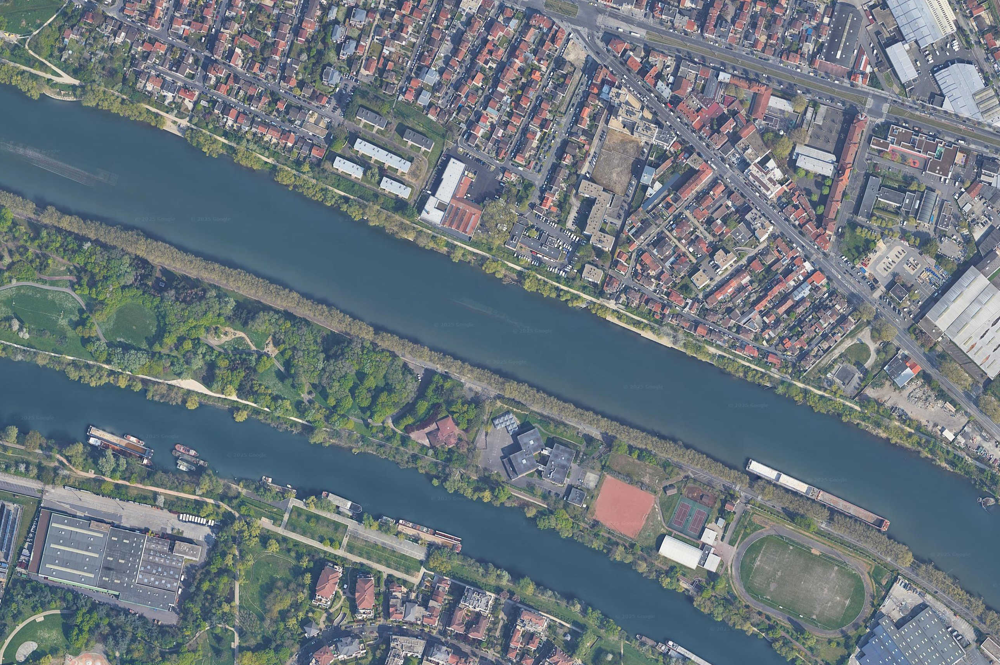
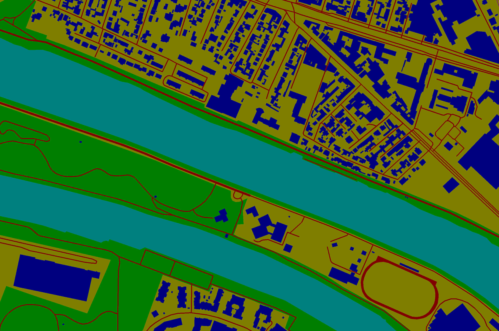
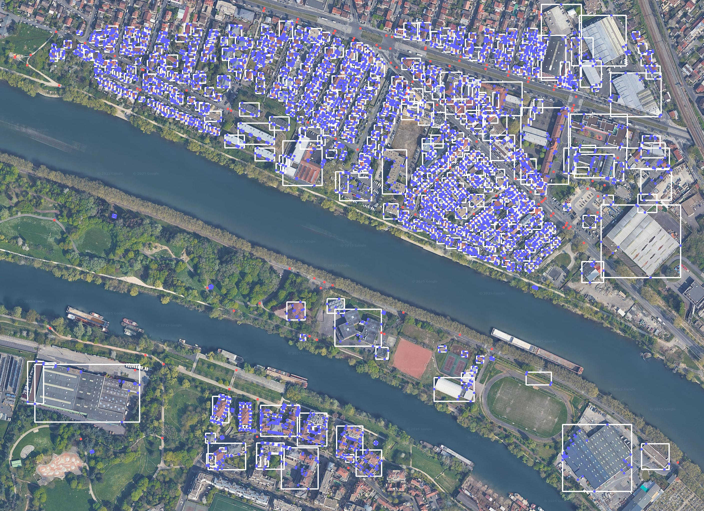

# SimpleAnnotationMap
Transfer Open Street Maps markup to Google Maps
<div>
  
  
  
</div>


## Install:
```bash
conda create -n osm python==3.10
conda activate osm
```

```bash
git clone https://github.com/AxuJIuyc/SimpleAnnotationMap.git
cd SimpleAnnotationMap
pip install -r requirements.txt
```

## Quick start:
1) Open runsam.py
2) Change the BOUNDS coordinates of the desired location from OpenStreetMaps
3) Run 
```bash
python runsam.py
```

At the output you will get:
1) original image
2) interactive html file
3) {name}.geojson with real coordinates all objects
4) .bmp image with applied masks
5) .json with pixel coordinates all objects
6) .txt objects annotated files with bboxes

Use multi_extractor for automatic saving many images
You need redact 'hand_palette' or create new function in palette.py for add new tags
